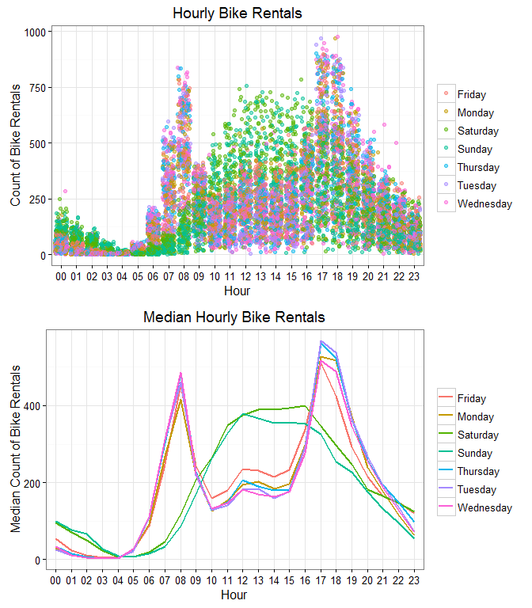
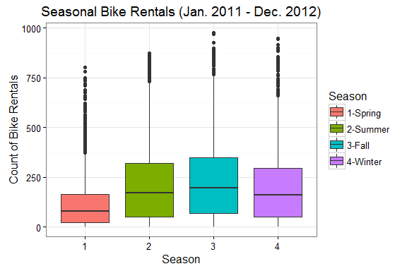
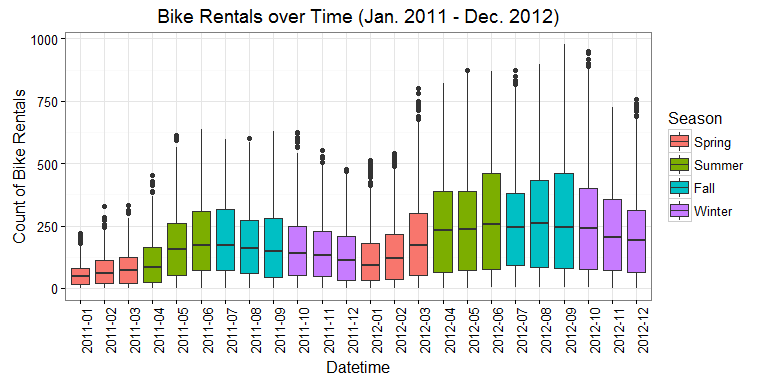
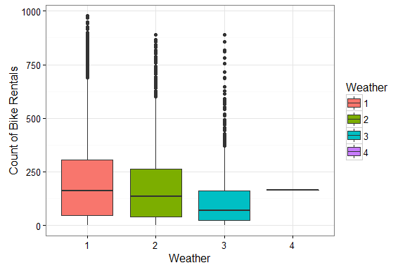
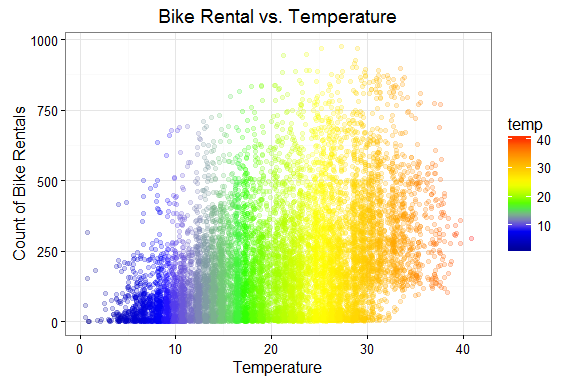
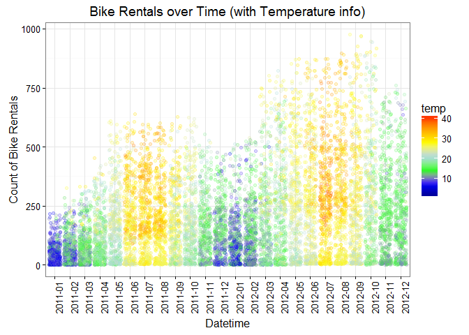
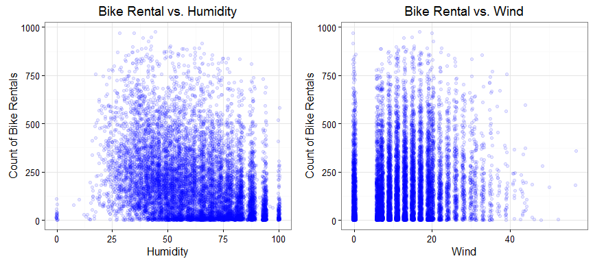
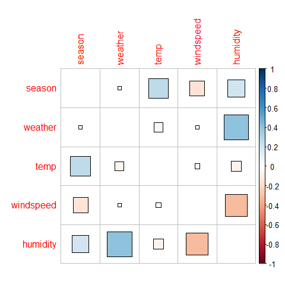
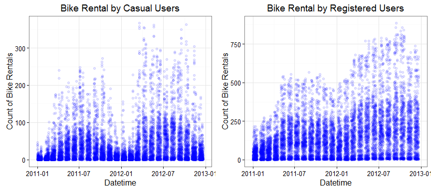
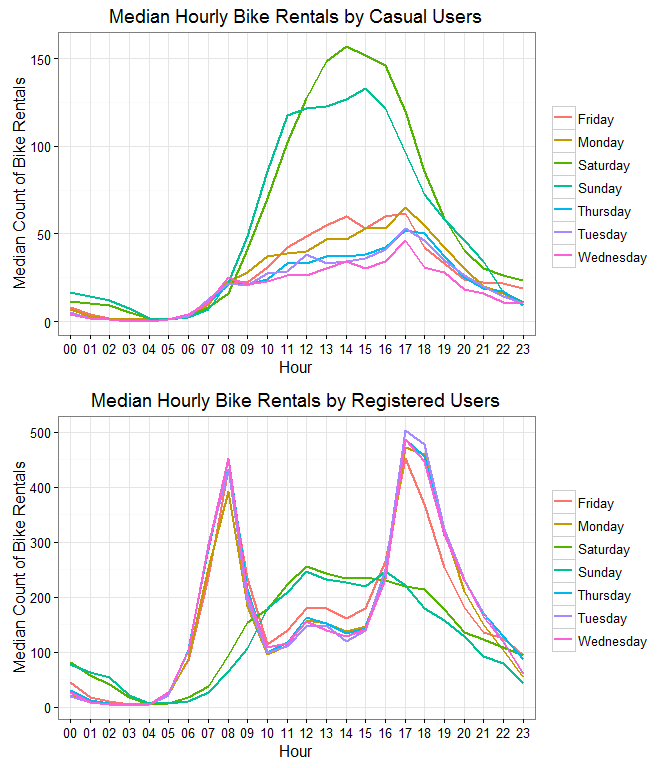

# Bike Sharing Demand Forecast_EDA
Yanfei Wu  
September 25, 2016  

* * *


## Introduction  

Bike sharing is a service in which bicycles are made available for shared use to individuals on a very short term basis. Using bike sharing systems, people are able to rent a bike from a one location and return it to a different location on an as-needed basis. As of August 2014, more than 600 cities worldwide had a bike-sharing program. The large amount of data generated by these bike sharing systems can serve as a sensor network. Studies on the mobility of the city can be carried out using the recorded duration of travel, departure location, arrival location, and time elapsed.    

The goal of this analysis is to explore the historical bike usage patterns combined with the weather data in the Capital Bikeshare program in Washington, D.C., and to forecast the total demand of bike rental.   

* * *

## The Data  

This project is a Kaggle competition and the datasets are obtained from [kaggle.com](https://www.kaggle.com/c/bike-sharing-demand/data). The datasets provide hourly rental data spanning two years (20110 - 2012). The training set is comprised of the first 19 days of each month, while the test set is the 20th to the end of the month.     


The training set has 10886 observations and 12 variables. The variables include:    

* datetime: hourly date + timestamp    
* season: 1 = spring, 2 = summer, 3 = fall, 4 = winter   
* holiday: whether the day is considered a holiday  
* workingday: whether the day is neither a weekend nor holiday  
* weather:  
    + 1 = Clear, Few clouds, Partly cloudy, Partly cloudy   
    + 2 = Mist + Cloudy, Mist + Broken clouds, Mist + Few clouds, Mist   
    + 3 = Light Snow, Light Rain + Thunderstorm + Scattered clouds, Light Rain + Scattered clouds   
    + 4 = Heavy Rain + Ice Pallets + Thunderstorm + Mist, Snow + Fog   
* temp: temperature in Celsius  
* atemp: "feels like" temperature in Celsius  
* humidity: relative humidity  
* windspeed: wind speed  
* casual: number of non-registered user rentals initiated  
* registered: number of registered user rentals initiated  
* count: number of total rentals  

For example, the first 6 observations look like this:  

```
##              datetime season holiday workingday weather temp  atemp
## 1 2011-01-01 00:00:00      1       0          0       1 9.84 14.395
## 2 2011-01-01 01:00:00      1       0          0       1 9.02 13.635
## 3 2011-01-01 02:00:00      1       0          0       1 9.02 13.635
## 4 2011-01-01 03:00:00      1       0          0       1 9.84 14.395
## 5 2011-01-01 04:00:00      1       0          0       1 9.84 14.395
## 6 2011-01-01 05:00:00      1       0          0       2 9.84 12.880
##   humidity windspeed casual registered count
## 1       81    0.0000      3         13    16
## 2       80    0.0000      8         32    40
## 3       80    0.0000      5         27    32
## 4       75    0.0000      3         10    13
## 5       75    0.0000      0          1     1
## 6       75    6.0032      0          1     1
```

* * *

## Exploratory Analysis  

By looking at the provided features, some questions arise, including:  

1. What is the bike rental demand at different times of the day? And different days of the week?  
2. Is there any seasonal trend in bike rental demand?  
3. How does weather (general weather condition, temperature, humidity, and wind) affect the amount of bike rentals?  
4. Is there any pattern for casual and registered user rentals?  


### Q1. How does bike rental demand differ at different times of the day? And on different days of the week?  
To answer this question, we can do some feature engineering on the *datetime* variable and extract *hour* and *weekday* to create two new variables. The bike demand can thus be plotted as a function of hour or weekday.    



The plots above show that the peak hours of bike rental on *weekdays* are around 8am in the morning and 5pm in the evening, which are typical times when people go to work and get off work. The peak hours of bike rental on *weekends* are between 11am to 6pm. Again, it is consistent with most people's living habits.  

There are also some interesting day-to-day variations as shown in the *Median Hourly Bike Rentals* plot. For example, there are noticebly more people renting bikes around noon on Fridays than four other weekdays perhaps because the workload is ligher so that people can get lunch out of work places. Also, the demand is much less in Sunday afternoons than Saturday afternoons probably because people tend to stay at home in Sunday afternoons.  

The above plots do not take into account weekdays that are holidays. But there are only about 4% such days among all the given weekdays. So, we would expect the general trends between working days and non-working days to be similar to the ones shown by the above plots. 


### Q2. Is there any seasonal trend in bike rental demand?   

The bike rentals in the four different seasons can be visualized by the boxplot below.   



It appears that the amount of bike rentals in spring is the smallest. It is counter-intuitive that even the amount of rentals in winter surpasses that in spring. Since we are dealing with time-series data, there could be some demand increases over time from Jan. 2011 to Dec. 2012. To check this, the demand over time is plotted as below.  


So it appears that the seasonal fluctuation of bike rental is actually convoluted with the overall demand increase from 2011 to 2012. The bike sharing seems to get more and more popular in Washington, D.C. over time. But still, there is a general trend showing that the demand during warm seasons (summer and fall) is higher.   


### Q3. How does weather affect the amount of bike rentals?   
There several variables in the dataset that are related to weather, including general weather condition rating, temperature, humidity, wind speed. Many of them are also related to season. Therefore, they are first explored individually and then the correlations between any two of them are examined.  

**General Weather Condition**  
There are 4 different weather conditions, from nice (1) to severe (4). The amount of bike rentals at these different weather conditions is shown below:  



It appears that there is only 1 data point for the severe weather (4). Still, there is a noticeble trend showing larger demand with better weather condition.  

**Temperature**  
The effect of temperature on bike rental demand is shown below:  


Overall, the bike rental demand increases with temperature. The demand is the highest when the temperature is around 15-30C. We know that temperature has a strong seasonal effect. So we can add the temperature information to the bike rental demand over time plot, as shown below:    


The above plot shows that the seasonal fluctuation of bike rental demand (ignoring the overall demand increase with time) could be largely attributed to temperature. 

**Humidity and Wind**  
So how about humidity? And wind? Similarly, we can plot count of bike rentals vs humidity or wind, as shown below:  


It appears that there are higher bike rental demand on more humid and less windy days.  

**Correlations between season and the weather-related variables**   
It is commonly believed that there are correlations between season and weather variables, as well as between different weather variables themselves. The correlations can be visualized as below:   


There are strong correlations between humidity and wind, general weather and humidity, as well as season with temperature, wind and humidity. 

### Q4. Is there any pattern for casual and registered user rentals?   

The casual and registered user rentals initiated are likely less important in terms of buiding our predictive model. But it is interesting to know whether there is any pattern in it. 


It is interesting to note that the number of registered user initiated bike rentals shows a significant increase over time, coupled with seasonal effect; whereas the number of casual user initiated bike rentals more closely reflects a seasonal fluctuation. This is indicative of a steady increase of registered users of the bike sharing system from 2011 to 2012. For casual users, their motivations to use the bike sharing system is still largely affected by weather factors, e.g., temperature. 

It is also expected that the bike riding habits can be different between casual bike sharing users and registered users. 


Indeed, casual users are more likely to initiate a bike rental on weekends, while registered users are likely taking advantage of the bike sharing system for commute to and from work. These registered users also use the bikes quite often on weekends. For the purpose of promoting the bike sharing system, it would be benefitial to build more kiosk locations near major companies in the city, or to offer discounted rate during rush hours. To target casual users, building bike kiosk locations near parks and malls would probably help.  


* * *

## Model Building  

(to be continued...)
