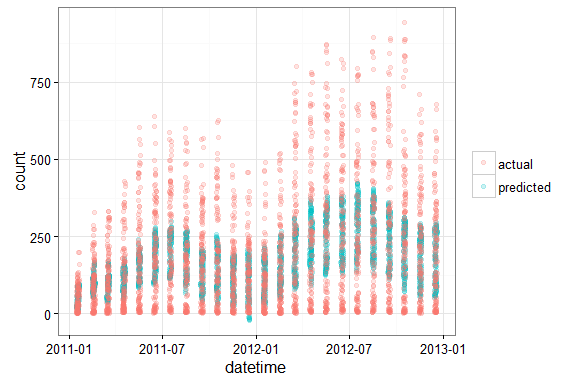
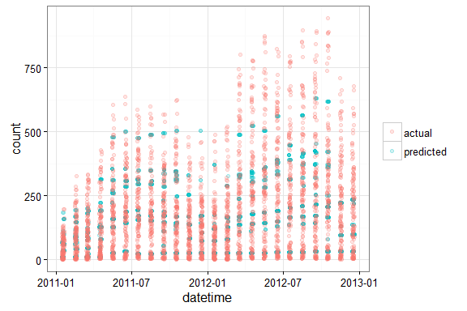
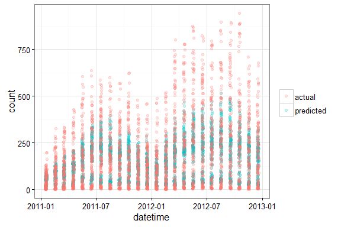
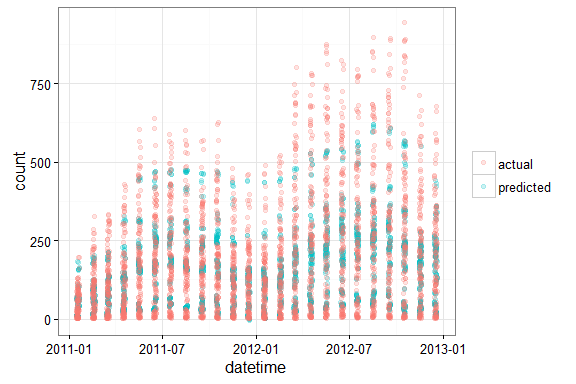

# Bike Sharing Demand Forecast_Models
Yanfei Wu  
September 28, 2016  

* * *


Continued from [last post](https://yanfei-wu.github.io/2016-09-26-bikeshare/) where exploratory analysis of the bike sharing data in the Capital Bikeshare program in Washington, D.C. was performed, this post will be focused on building models to predict the actual bike sharing demand. In particular, different predictive models will be compared. All the codes for this post can be found in [Github](https://github.com/yanfei-wu/kaggle/tree/master/bikesharing).  

* * *

## Pre-processing  

The train and test datasets were provided by Kaggle. The test dataset is unlabeled. The prediction of the test set is submitted to Kaggle to obtain a score (based on quadratic weighted kappa to measure the aggrement between human rating and the predicted rating). The score is further used to evaluate the model. The labeled train dataset looks like this:  


```
## 'data.frame':	10886 obs. of  12 variables:
##  $ datetime  : Factor w/ 10886 levels "2011-01-01 00:00:00",..: 1 2 3 4 5 6 7 8 9 10 ...
##  $ season    : int  1 1 1 1 1 1 1 1 1 1 ...
##  $ holiday   : int  0 0 0 0 0 0 0 0 0 0 ...
##  $ workingday: int  0 0 0 0 0 0 0 0 0 0 ...
##  $ weather   : int  1 1 1 1 1 2 1 1 1 1 ...
##  $ temp      : num  9.84 9.02 9.02 9.84 9.84 ...
##  $ atemp     : num  14.4 13.6 13.6 14.4 14.4 ...
##  $ humidity  : int  81 80 80 75 75 75 80 86 75 76 ...
##  $ windspeed : num  0 0 0 0 0 ...
##  $ casual    : int  3 8 5 3 0 0 2 1 1 8 ...
##  $ registered: int  13 32 27 10 1 1 0 2 7 6 ...
##  $ count     : int  16 40 32 13 1 1 2 3 8 14 ...
```

There is datetime, and some coded variables such as season, weather, etc. The detailed variable information can be found from the last post. Some important findings about the dateset from EDA performed in the last post include:  

1. *Hour* is an important feature that can be added to the dataset because there is a clear pattern of bike demand at different times of the day.  
2. The bike rental demand also differs by each day of the week. Adding a feature *weekday* can certainly capture the day-to-day variation. So it might be better than just using *holiday* and *workingday* variables.   
3. The seasonal fluctuation of bike rental demand is convoluted with the overall demand increase over time. This makes a linear regression model less helpful in this case.
4. The seasonal fluctuation (ignoring demand growth) is strongly related to weather variables, especially temperature. 
5. *Casual* and *registered* user initiated bike rentals show distinct patterns in both hourly basis and daily basis. For casual users, the seasonal fluctuations more closely reflect the actual season effect. So a linear regression model might be useful to predict casual user initiated bike rentals.   

Keeping these in mind, I would like to explore and compare linear model and tree based models. The goal is to determine benchmark performance for different models. Therefore, only basic feature selections will be carried out instead of very sophisticated ones.   

First of all, some pre-processing steps are carried out for the dataset, including:  

1. Convert *datetime* variable from factor variable to date-time class.   
2. Convert intergers to factors for the coded variables such as season, workingday, weather.  
3. Add *hour* and *weekday* features to the dateset.   
4. Split dataset into training and cross-validation sets for model tuning purpose. *Note*: instead of random split, in this case, the dataset is split by each month of the two years, the first 14 days of the month as training set, and the 15th to 19th as cross-validation set.     


* * *

## Model Selection  

In this session, linear regression and tree based models are compared.   

*Note*: only the past data is used to predict the future data. So for each subset of the cross-validation set, a new model is built using specific training data based on the cut-off time determined by the cross-validation subset.   

### Linear Regression  

As stated above, linear regression seems not to be very helpful in this case because of the combined seasonality and the overall increasing trend. But just to see exactly how it performs and to set a baseline, linear regression model is built and evaluated. 




Apparently, the model somewhat captures the seasonality but largely fails in predicting the overall growth trend. The root mean squared error for the cross-validation set is 146.27. The Kaggle score obtained by using this model (with the entire train dataset, cross-validation set included) is **1.16**.   

However, the plot above also implies that a linear regression model should work well enough for predicting demand from casual users. I will revisit this later. 


### Tree-based Models  

Unlike linear models, tree-based models can map non-linear relationships quite well. So decision tree and random forest models are explored and compared here.  

#### Decision Tree  



It appears the model captures some seasonality and growth trend. The root mean squared error for the cross-validation set is 104.22. The Kaggle score obtained by using this model (with the entire train dataset, cross-validation set included) is **0.80**, which is a significant improvement from linear regression model.

#### Random Forest  

Random forest model operates by constructing a multitude of decision trees and it can correct for decision trees' habit of overfitting to their training set.  




Again, the model captures to certain degree both the seasonality and growth trend. The root mean squared error for the cross-validation set is 114.24. The Kaggle score obtained by using this model (with the entire train dataset, cross-validation set included) is **0.81**, which is similar to decision tree model.


### Linear Regression + Decision Tree 

As mentioned above, the casual users and registered users show different bike rantal patterns. The casual user initiated bike rentals mainly show seasonality, and thus a linear regression model should be useful in predicting the demand. But for registered user initiated bike rentals, growth with time as well as seasonal difference exist and a tree-based model is better for prediction.  

So what if we combine the two models? After all, the total demand is the demand from casual users and that from registered users. What if we predict the former with a linear regression model and the latter a tree-based model, e.g., simple decision tree.  




Clearly, the combined model is doing much better than the linear regression model alone. The root mean squared error for the cross-validation set is 106.67. The Kaggle score obtained by using this model (with the entire train dataset, cross-validation set included) is **0.83**, which is slightly worse than the decision tree or random forest model alone.  

* * *

## Conclusion  

To summarize, tree-based models are better than linear regression for predicting the bike rental demand because of the seasonality and overall growth trend in the dataset. The dinstinct patterns between demand from casual users and registered users also allow us to combined linear regression and tree-based models in this case.  

Note that the scores obtained so far are more like the benchmark performance of different models. The scores can be further inproved by more sophisticated feature engineering and selection. 


